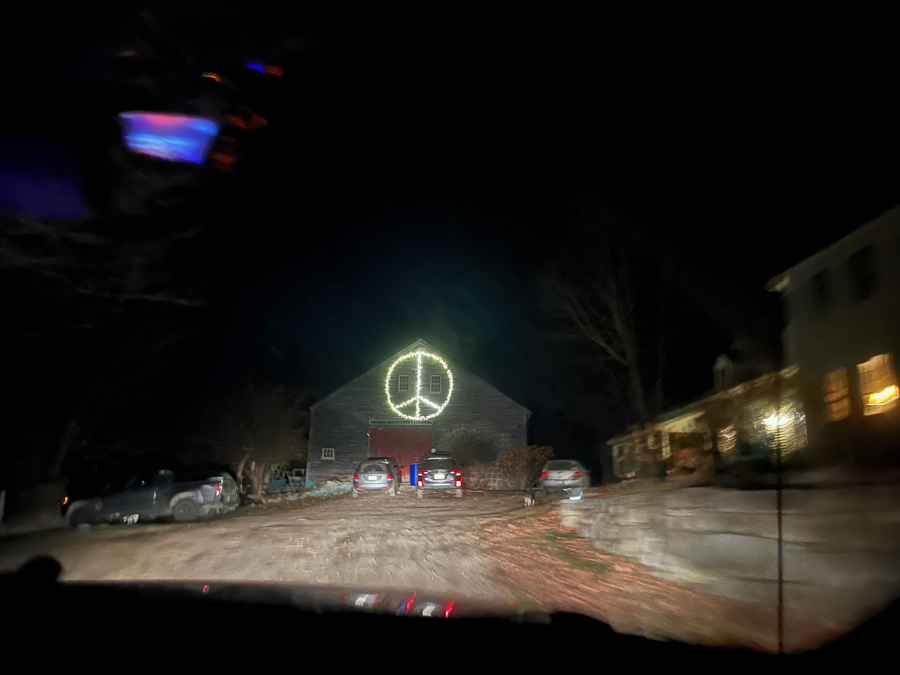
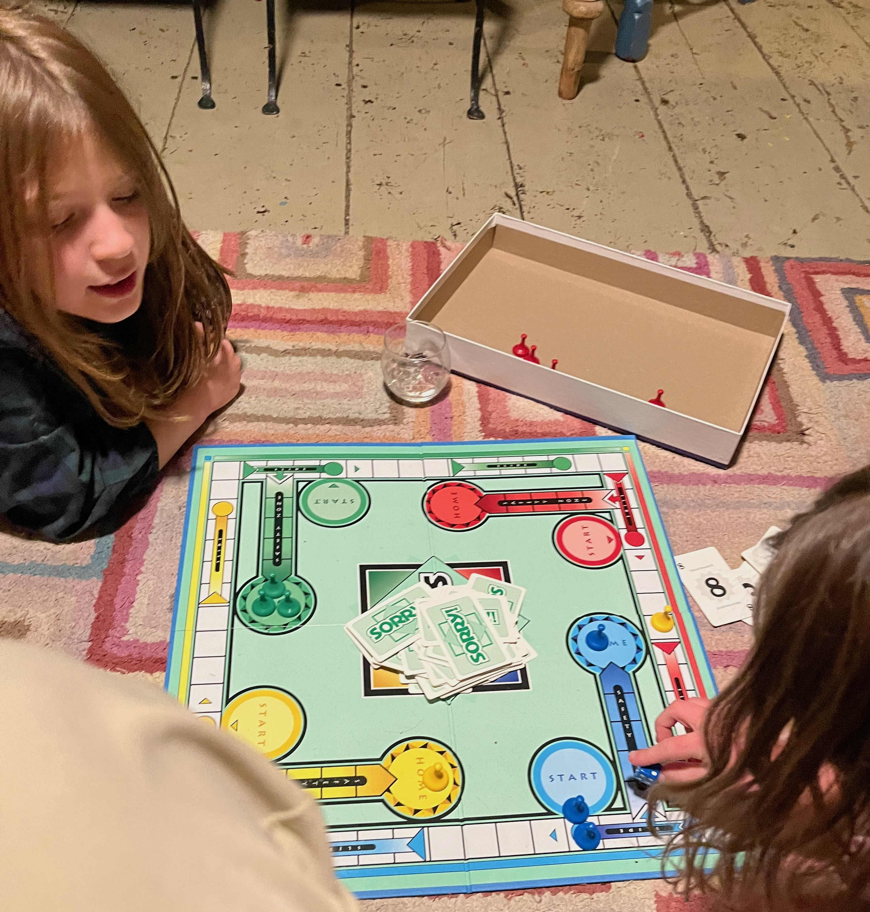
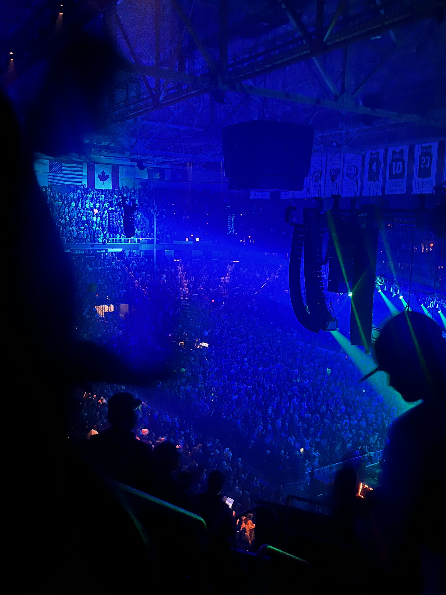
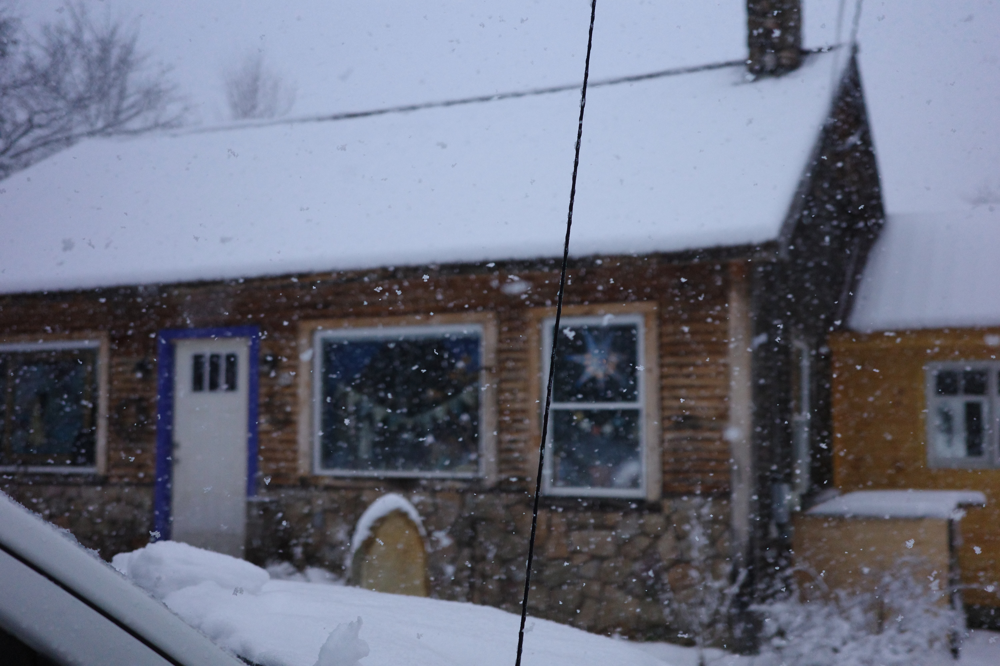
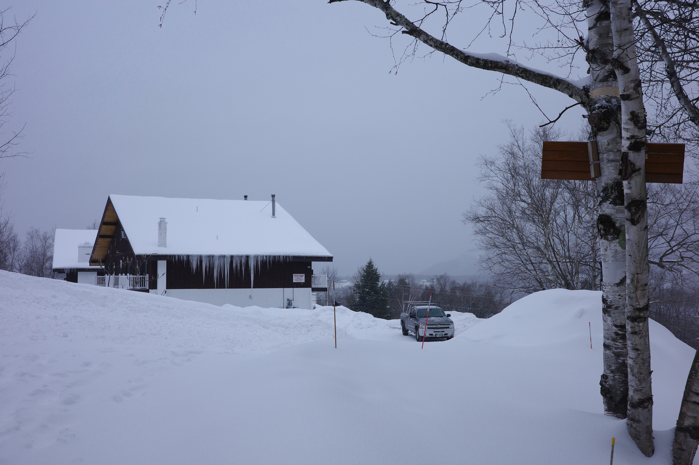

Words become powerless when you feel so strongly about a place or a person. Nevertheless, I’ll try to put them down.

I met Patrick when he still had those dreadlocks. He is a heavily bearded man who had just turned 40 last year, but still youthful in spirit. He's the kind of person who would make a good cartoon character, in my opinion. In late November, 2022, on the 2nd day of my Thanksgiving break, I took a bus up to the bus stop by an Inn in North Conway, New Hampshire, where Pat was finishing up some work nearby. Pat picked me up in his truck (with a weathered “Bernie 2020” sticker on the back) around 2pm, as we have arranged previously, with a big smiley face. I put my bicycle and a suitcase, which I carried on the bus, onto the back of his truck. We dropped by Hannaford first, because I wanted to do some grocery shopping. Pat really wanted to watch the World Cup games and started to watch on his phone while waiting for me. I was renting a room in his house for a few days, because I didn’t have anything better to do. He drove me to his house in the woods. It was close to Saco river and right next to a deserted railroad.

The same day I got there, Patrick invited me to a Friendsgiving dinner at a friend’s place, after I told him that I don’t have family in America. It turned out to be quite memorable, and honestly the best Thanksgiving dinner I've ever had in my life. His friend's name was Hilary, and their house was on the top of a hill with a huge peace sign on it that was lit. We had very good food, mashed potatoes with pecan, homemade cranberry sauce, turkey with gravy, you name it! All the good Thanksgiving stuff. The guests at the party were also quite interesting. I met Justin, a weed farmer in Maine who told us about his travels in Chile during the '80s as a student of film, and how everyone talked to him so keenly about political persecution under Pinochet’s dictatorship for a documentary that he was working on.

There was also Marnix, who is Dutch, lives in southern New Hampshire (near Keene, I was told, which would make it a long drive up), but teaches courses at Yale University. His wife is French, together they had 5 or 6 kids, who all showed up at the party. I also met Charlene, and her little daughter Becca. There were also many other guests that I don’t recall the names, but they were warm people. I played board games with Becca and Marnix’s little daughter, Montagne. The kids also played games on Wii like _Just Dance_. I joined the game because Becca said I would be good at it. So I found myself dancing to _Call Me Maybe_ with two 8-year-olds that night, after having some good wine and cheese, and there is nothing more comical. I’ve always found the presence of kids to be quite calming, and they also seemed to enjoy mine.

I don't have much impression of the next few days, aside from cycling to Cathedral Ledge, hiking the trail, and taking in a breathtaking view of the surrounding valley. I didn't realize then that in the years to come, I would join Patrick on far more eventful hikes up much bigger mountains. Another trail I like to do on my own is Black Cap. It's a relatively short walk (about an hour), but with good elevation gain and fascinating views of the New Hampshire and Maine landscape. I like to bring a book and stay at the top for a while. There's something special about being on your own on a mountaintop, listening to the wind and the tranquility of nature. I always feel like I get a new perspective on things up there."

I enjoyed my stay, and kept coming back to Pat’s place for a few times throughout the years, and almost every Thanksgiving. 

Pat is about a quarter Armenian (he would later tell me he only found that out after a DNA test, and presumably because his grandma from upstate N.Y. had cheated), which explains his dark hair and beard. He was quite enthusiastic, a little avoidant (when it comes to conflict-resolution and emotions), individualistic, like any other rural New Hampshirite living on their own, but also incredibly warm and sociable. He’s the kind of person who picks up hitchhikers, hands out cash to homeless veterans, and chats with people who work at grocery stores. His house often had guests. I learned that he spent a few years in South America after college and can speak fluent Spanish. He also had a girlfriend that he met there, and she was still in Uruguay. I didn’t know too much about her aside from that she only speaks Spanish and would come over during the summer to help Pat with work (he manages rental properties for a company).

Patrick was born in Northern N.Y. and moved to Conway with his family when he was 5.  He grew up always seeing the mountains in the backdrop and told me how he only realized it's so special after moving away for college, in upstate N.Y., eventually dropped out and spent a few years in Uruguay to start a business with his friend from college. He didn't do much hiking when he was small, but it became one of his major obsessions after he moved back. He had this map with all the mountains in New Hampshire, and most of them are marked, based on times they have hiked them and in which season. He told me that the winter here is long and tough, but it's the beautiful hikes that make it worth it . He really likes this part of New Hampshire, and would be dying to come back whenever he had to travel for a certain amount of time.

Pat had a heart of curiosity, we could chat about almost any topic. He likes to learn about languages and history, and inquired about Chinese history in a manner that's almost a little obtrusive to me. He also liked reading about science, especially physics, chemistry, and biology. We would watch science videos, like the ones from Veritasium together, on matters such as how nuclear fusion works, or what's behind a transformer model (LLMs, for example). He also had this habit of watching a different film almost every night, and I joined him a few times. 

I only became much closer to Patrick about one and a half years later. During a visit in early summer, I learned that Pat was quite fond of this band called Phish and saw them more than 50 times in total. In other words, he was one of those _Phish boys_. In July 2024, Phish held a concert in Mansfield, Massachusetts, not so far from me and I was curious enough to go. Pat met me near the concert grounds that day around 5pm, enthusiastically telling me it's going to be like *Tiananmen Square*, (an insider joke that made sense to us), and just like that, I had an interesting time. The music was quite creative and the other concert goers were very enthusiastic as well.

I soon found out there was another Phish concert in Albany, NY in late October and I planned to come again. I took the train to Pittsfield, Mass., stayed over for a night, and then I took the bus north to a Walmart parking lot in West Adams, where I met Pat. I noticed that Pat’s dreadlocks are gone, and he showed me his marriage ring on the left hand, announcing that he got married to Evelyn in August, after which she returned to Uruguay, but hoping to come back and settle down permanently with her daughter in about a year or two. I genuinely felt happy for Pat, knowing that he will become a family man, but also realized that this new responsibility might distance us (it turns out that wasn’t the case, which I’ll explain). Apparently he also cut his dreadlocks, because his wife wanted him to (I did think it was a good change but his Phish friends probably had other ideas). We hiked Mount Greylock that day, the tallest mountain in Massachusetts (still tiny by N.H. standards).

Because we were running short on time, I had the idea of catching a ride from a fellow visitor on the way down, something I would do. We met this friendly-looking Republican couple at the parking lot near the peak, who offered us snacks and instantly agreed to take us down the hill. We had some charcuterie, locally produced bread from eastern Conneticut (where the couple drove from), some non-alcoholic beers, and chatted a bit about politics. Patrick (who is actually more of a socialist and atheist) started to pose as a proud Trump supporter, like he always did in those scenarios, and denounced the evils of the Biden-Harris administration, which included rising prices for gas and groceries, among other things. I just tagged along and laughed. Pat also told them that “I was more American than some Americans”, which I took as a compliment (still have no idea what that means or whether he was serious). 

We listened to a song called Shanghai, which is also the city I am from

<iframe style="border-radius:12px" width="100%" height="152" src="https://www.youtube.com/embed/-01sgnVgkRc" frameborder="0" allow="accelerometer; autoplay; clipboard-write; encrypted-media; gyroscope; picture-in-picture" allowfullscreen></iframe>

After the amusing chat, they gave us a ride to somewhere halfway of the mountain. We then came downhill relatively effortlessly and got into Pat's car. We took a scenic back road on the way to New York State. This was my ideal road trip, listening to _King Gizzard & the Lizard Wizard_ (another psychedelic band), looking at the foliage-covered landscape of autumnal Western Mass. on a country road, until darkness fell upon us by the time we had crossed the state line. That was only a little before we reached the light of the city.

I only went to first of the four Phish shows but Pat, like many other _Phish boys_, stayed in Albany to attend all four of them. I tried some magic mushrooms that day under Pat's suggestion (though I normally don’t venture into psychedelics or drugs). I only took half of what Pat did, right after coming down from Greylock, but it only started to kick in when we were already inside the concert hall, a few hours later. The dosage completely knocked me out, while it didn't have a noticeable effect on Patrick. All of a sudden, I wasn’t able to tell my position in time and space, which was a bit unnerving.

I bumped into other people quite a few times during and after the concert, and Pat had to explain to everyone it was the first time I ever had _mushrooms_, so people wouldn't try to fight me. Other than that, I had an exceptionally beautiful night. During the concert, I felt like I was able to examine my thoughts and understand my motivation better, while looking at the colorful lights that came from the stage. I thought a lot more about what I really value and pursue in life (without coming to any clear conclusions), and felt genuinely connected to other humans. It felt like a cognitive barrier in my mind was broken down. I also came to realize how much I really value my family, even though I am in a distant land and have not been all that close to them.

It’s a closed-door concert hall with lots of pot smokers, and close to the end of the concert, the air felt quite filthy, which I detest. Whatever they were smoking was probably not organic. Patrick had to help me walk to the house I was staying because I had a hard time walking in a straight line under the influence of mushroom. It turned out to be a few miles of walk and we had the company of many other concertgoers. Patrick asked me about the experience, I asked him as well, about what he experiences when doing mushrooms and what he likes about it. He told me that mushroom helps him focus on what really matters, before saying goodnight. At the house, I slept really well. The next day, Pat drove me across Hudson River to the train station in Rensselaer, where I took the train back to Boston.

During the Thanksgiving of 2024, I came back to Pat’s house again. It had already started to snow a little bit the night I got there. The second morning I woke up, I saw the sunlight coming through the windows into the common area on the ground floor, through the branches of trees in the forest overlaid with snow. It's not too cold inside, but I could definitely feel that I am in Conway, where the air is much more crisp and clean, compared to suburban Boston. I took a walk around the neighborhood, heard the sound of thawing snow on the branches over my head, which I only noticed for the first time in Pat's backyard. I even asked Pat what it was when I came back from the walk. That sound was accompanied by visuals of falling water drops layered between branches.

On Thanksgiving, there was a huge snowstorm, which was somewhat unusual, because it normally doesn't snow so much so early. Pat was planning to go to his sister’s house for dinner, which was about 3 hours away in inland Maine, but due to the snowstorm, it wasn't safe enough. He was also invited to another dinner right in Brownfield, Maine, only about 20 minutes away. It’s two women who work at the bakery in North Conway, Stacy and Jodi, who were in their late 40s and 60s, respectively. They invited Pat because he was friendly and always had a nice chat with them. So we went to the dinner at Jodi’s house, cozy and wooden, with a huge tree trunk in the middle.
  

Stacy and Jodi gave both of us huge hugs as we walked into the house, and we listened to _Grateful Dead_ in the background. I watched them smoke weed, but didn't do it myself because at that time I still didn't know how to smoke properly and didn't particularly want to. Instead of turkey, we had chicken, but we also had some homemade cranberry sauce with a pinch of citrus, and other classic Thanksgiving food, in addition to roasted Brussels sprouts. The neighbor who moved here only a few months ago from New Jersey also dropped by and gave us some homemade bread. The long conversation we had was interesting; we talked about topics like whether an eternal soul could exist, et cetera. It was nice and warm inside, even though it started to snow heavily towards the evening.

The next day we attempted to hike up Mt. Nancy, which Pat claimed to be his fifth favorite hike in the White Mountains, with snowshoes. Pat is an experienced hiker, he hikes one major mountain in the area almost every weekend, regardless of the season. He once showed me pictures of the beautiful cascades there when he went during the summer, but winter hiking is quite different. I didn’t have the right boots. I had some hiking shoes that I thought would be good enough but they were not waterproof, which turned out to be problematic. It was my first time snowshoeing, so I wasn't too sure what to expect. I stepped onto some icy water and got my feet wet, and it started to felt really bad as we were approaching the ponds. Patrick had to rescue me with some spare wool socks and heat bags, and that was quite dramatic. He said that I would have gotten frostbite if we didn't turn back at the moment, but told me that we would try this again after I got the right boots. 
   
After coming back, Patrick asked me if I wanted to help him shovel the next day, and that he would just pay me by the hour. Pat manages about 21 rental properties in the Conway area, and shoveling after snow storm is simply a part of his job. He said he would like some help because it snowed a lot, I didn't have much better to do so I accepted, of course. We went to all those different houses and did a lot of work, it was somewhat physically exhausting but I actually really enjoyed it. It was also a cool way to tour the area and see varied snow scenery from many different points of view. We were also able to talk to the many different guests that were staying at those properties and they would tell us stories about their lives, give us some whiskey or soda to drink. Conway is a popular destination for families during Thanksgiving, apparently.  

I came back again during Christmas. I went skiing with a Taiwanese family who was staying over. They drove up all the way from North Carolina. A mom and her seven-year-old son, Robin. We watched Christmas movies almost every night with Patrick. The little kid taught me how to ski, and skied a lot better than I did. Even though I thought I was doing quite good on the bunny slope, I wasn’t able to conquer the really steep slope, and fell about 100 times before I was able to get down. Robin just did it kind of effortlessly. At home, I made soup, and Robin played Minecraft on his laptop.

The next day I went to hike up Mt. Hales with Pat with snowshoes, and it was a long hike because parts of the road to the trail were closed during the winter and that added quite a lot of extra mileage. Nevertheless, I got my boots this time and was able to get all the way up. There wasn't a great view on the mountain, but I was really content since it was my first successful snowshoe hike. The valley of snow looked completely different than anything I had seen in the area. I could listen to the sound of snow falling down from the trees and feel the snow dust dropping onto my face. It was almost enchanting.

Pat has deeply influenced me in many ways. I quite appreciate his attitude, kindness, and his naturally curious spirit. My last time in Conway was in mid-February 2025, when I came back again to shovel snow with Pat and stayed for a few days. Unfortunately, Pat has not talked to me since then, largely due to my fault.

It just happens that what I thought, at the time, would be a forgivable mistake, turned out to be an _unpardonable offense_. Friction became evident even before the fallout, though it’s not all that relevant. I noticed Pat started to be quite annoyed by certain quirks and _habitudes_ of mine that he might have been fine with previously (for example, asking questions to which I already know answers). We also didn't have any guests to talk to during the shoveling, presumably due to more snow and  harsher weather, so the shoveling experience was less convivial. I still remembered, however, when I was shoveling one of the houses, Patrick was chatting with a friend over the phone, telling him something in the lines of “Hey how’s going? I am with my buddy Toby. He is helping me shovel 21 houses and I am paying him, like… communist wages”, in a quite upbeat tone. Nevertheless, the work had also become harder than it was in November, because the snow hardened after the rain. It took us more than two days, to shovel the number same houses that we finished in one day back in November, and it didn’t feel like as much fun.

Whatever the cause, losing a friend really hurts me, especially when it’s due to my own action. I crossed a boundary that mattered deeply to him, one I didn't fully understand until it was too late, which cast an irreversible effect. That night, Pat became incredibly reticent, he didn't reproach me or talk about the event in any form——it was just silence. The only thing he said that night was just telling me the metal container from the takeout the other day needs to be washed and recycled, instead of going in the trash (he has always been methodical about recycling, just like any good Sanders supporter), and about other logistics. The next morning before driving me to the bus stop, he also told me to bring my vinyl records with me, which I initially planned to keep at his place. After the fact, there’s nothing I can do aside from becoming (“more mature”——as in a message that was sent to me a few days latter, his last message) and more mindful, but sadly, there will be no Pat in my life anymore. 

 

I have yet to embrace the fact that people can just come and go and there are changes that cannot be unmade. For me, Conway, New Hampshire, is not just a place, but a _rite of passage_. I still reminisce about the conversation I had with Pat while winter hiking, shoveling, the jokes we exchanged, and the stars we saw on the way back from shopping at Hannaford. **Good memories never get old.**
  
Upon reflection, our relationship was perhaps asymmetrical. I feel like I got much more out of it than Pat did. I still live in a period of uncertainty without having established myself through a stable career, a constant presence in a rural area, or a house of my own in the woods. He's older and had a lot more experiences in life and had much more to offer, so it seemed.

I didn’t really expect that Pat would cut me off so categorically for what I had done, it almost felt uncanny. Perhaps there’s something intrinsic about being American that is so ruggedly individualistic that I still don’t yet understand, something that we owe to the Puritans, the Normans, or the Anglo-Saxons——the cultural ancestors of Americans. We live in a vast nation where people move often in their lives and make new ways relatively easily, so Americans do not seem to be so attached to people they were once close with. Yet, perhaps it’s simply a protection mechanism because Patrick has experienced more dramatic betrayals in the past? Your guess is as good as mine.

The departure of Patrick, or to be precise, my very own departure——as he drove me from his house to the bus stop the next morning (my scheduled day of leaving; it almost seemed like, a bit deceptively, as if I just stayed for one day less everything would have worked out okay) forced me to realize that my friendship with him was merely a happy detour, a snapshot into a not-yet-existent future, rather than a solution to my existential exile in America. The real battle continues elsewhere——as I find a way to found a place I may call home.

## After Conway
Writing this in late Jan. 2026, I am on a beach on the Big Island of Hawai'i, and it's almost a year after the rupture. I still feel like I learned a lot in Conway, being open to connection, getting to know people in ways I am not conventionally supposed to, which I have carried on in the past year after college. I remember that my bonding with Pat had felt at the same time  strong and fragile. However, upon a closer look, so are most of my adult relationships, and perhaps even life itself——filled with unknowns, challenges, but also hope and possibilities. After college, I went to quite a few different farms to do work across America (and travelled to Britain and France during the summer). It was through a program that Pat told me about when I mentioned my fantasy of staying at a farm and doing work there, in exchange for food and lodging. I hitchhiked tons almost anywhere I went, met new people, and saw a whole lot. My dream came true in many ways, though it was somewhat forced, due to a lack of better employment. In late November, about two months ago, I winter hiked in the White Mountains again for a few times, each time making a new friend. Life goes on beautifully and cruelly, without the slightest regard for our innermost desires.

Listening to

<iframe style="border-radius:12px" src="https://open.spotify.com/embed/track/6dKntZwVJx0QLX6IM19gC7?utm_source=generator" width="100%" height="152" frameBorder="0" allowfullscreen="" allow="autoplay; clipboard-write; encrypted-media; fullscreen; picture-in-picture" loading="lazy"></iframe>

