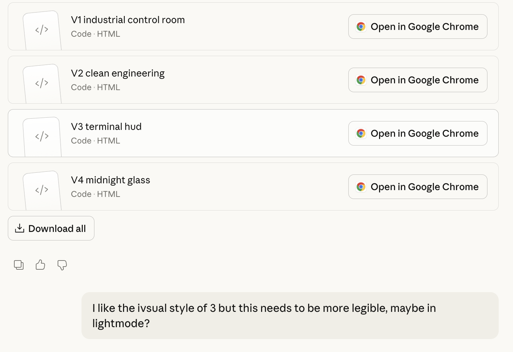
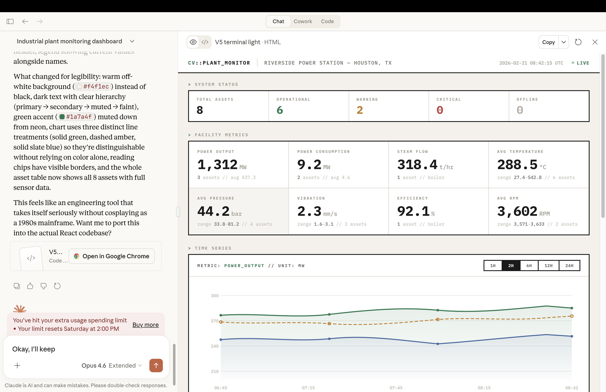
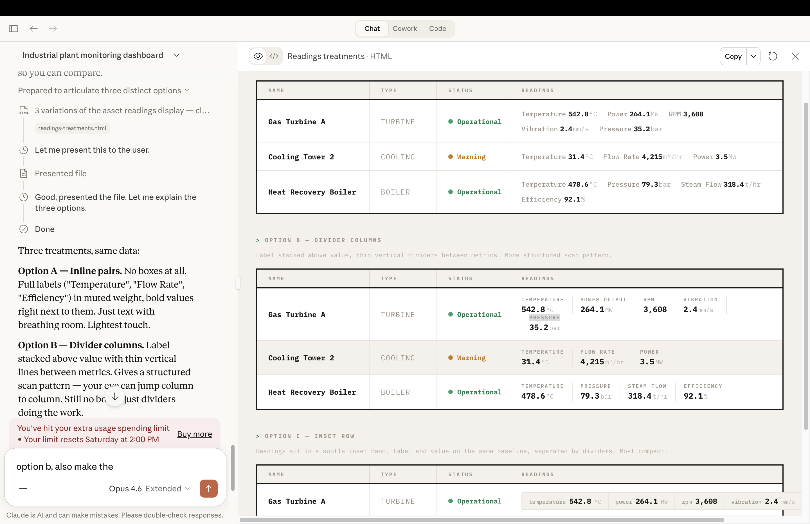
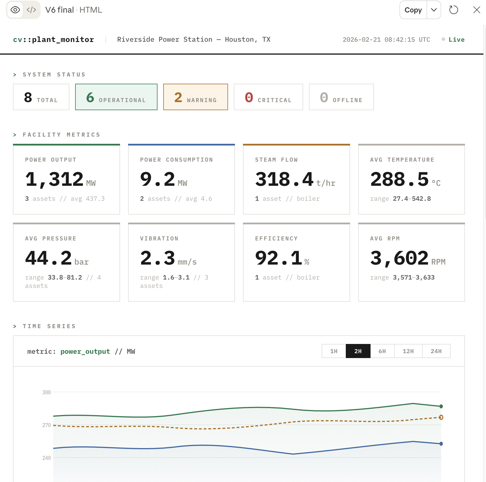
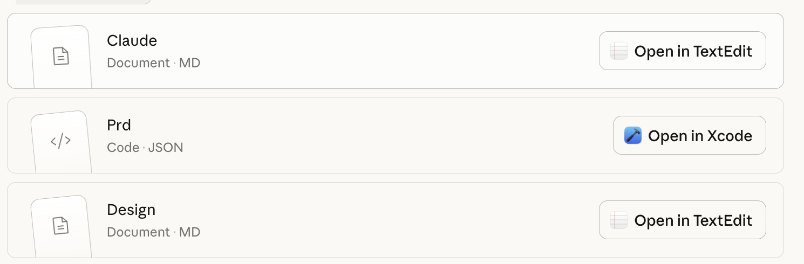
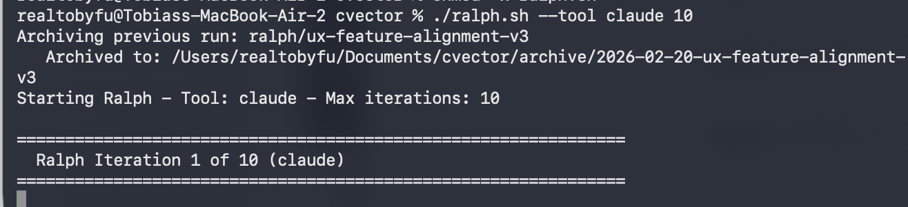

*Friday Feb 20th*

I decided that I would use a ralph wiggum loop overnight to build the project, being inspired by Geoffrey Huntley's article [Ralph Wiggum as a "software engineer"](https://ghuntley.com/ralph/).

The idea behind ralph (from [Geoffrey's article](https://ghuntley.com/ralph/)) is when we are engineering a series of features we break them down into incremental steps each with its own user story and acceptance criteria, and we are going to run LLM sessions where each time it tries to work on one feature, document its progress until all tasks are accepted. If a ralph iteration (1 LLM session) doesn't complete one task, it's going to write its progress on that task into a file, so the next run can pick it up.

With all its limitations, I found it to be a strong approach when we need to build a sophisticated app from ground up.

This is the ralph script I ended up using: https://github.com/snarktank/ralph/blob/main/

I chatted with Claude about how to do the frontend and database design, after feeding in the context about the project.

I asked it to give 3-4 frontend designs and settled on one of them, asked it to use light mode and make the UI more legible (since we are using it for industrial control purposes, readability is key)

Then I fine-tuned how certain parts of the UI should look to enhance readability, wanting it to be functional and distraction-free.

Ended up with this clean design that I liked a bit better.

After that I told Claude about Ralph, I discussed the 3 tasks again (**Database schema**, **Backend API** and **React dashboard**), and asked Claude to generate a `CLAUDE.md` that contains basic instructions (where I also emphasized that we need to use Playwright MCP to validate UI tasks) and a `prd.json` that contains all the incremental tasks and user stories we need to build those features. I decided that it's best to use what resembles CVector's tech stack, which includes *React*, *Ant Design*, and *FastAPI*.

I supplemented that with SQLAlchemy as the ORM (the standard pairing with FastAPI), SQLite for portability because it's just a take-home challenge, Recharts for time-series visualization (Ant Design doesn't ship its own charting library), and Vite as the build tool.

Design.md gets referenced in the sessions if needed (progressive disclosure)

We got 8 tasks in total, fewer than I imagined, and to run the ralph loop, we just use the command `./ralph.sh --tool claude 20` to give it 20 max iterations (just to be safe). Inside the sh file, we call `claude --dangerously-skip-permissions`, but this is okay since we're in a sandboxed environment and a greenfield project.

We ended up completing all the tasks in just a few ralph sessions, and here's the completed product:

---

The whole thing took about one evening. The key insight for me is that the ralph loop works best when you front-load the thinking — spend time on the PRD, the task breakdown, the tech stack decisions — and then let the loop handle the mechanical execution. The LLM is remarkably good at grinding through well-scoped tasks, but it still needs a human to decide *what* to build and *why*. That division of labor felt right.
