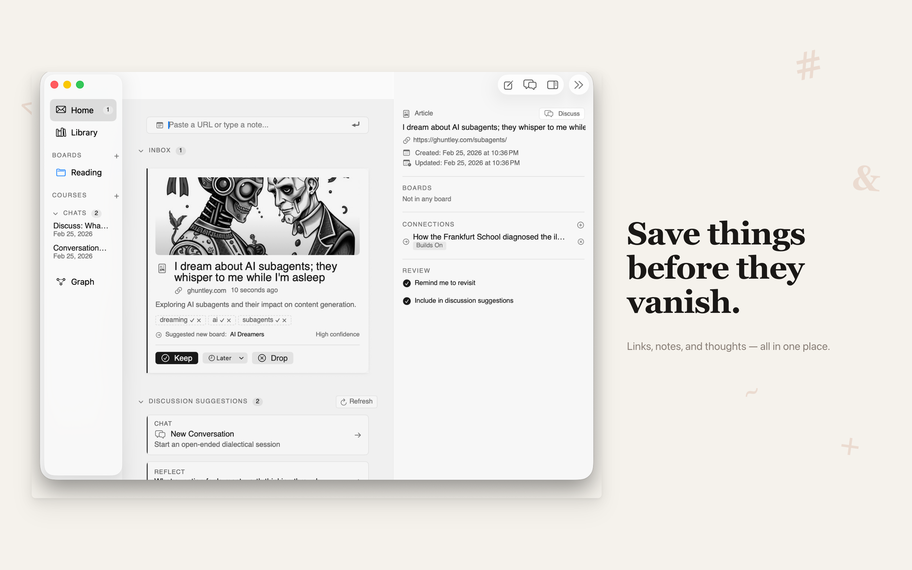
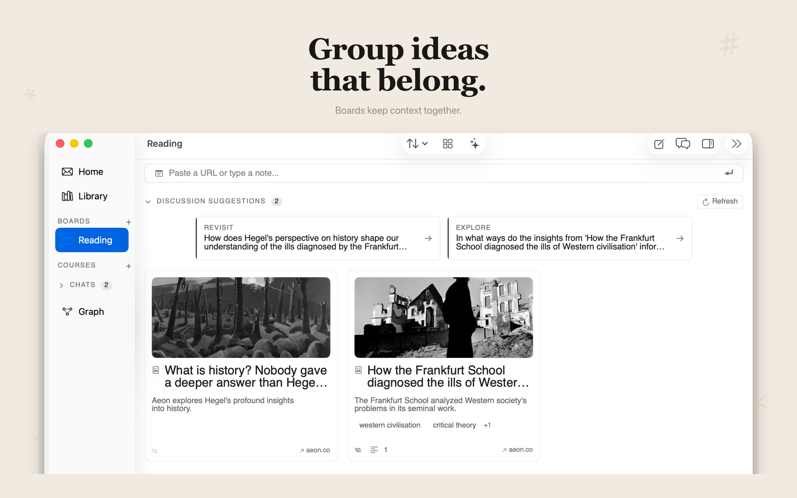
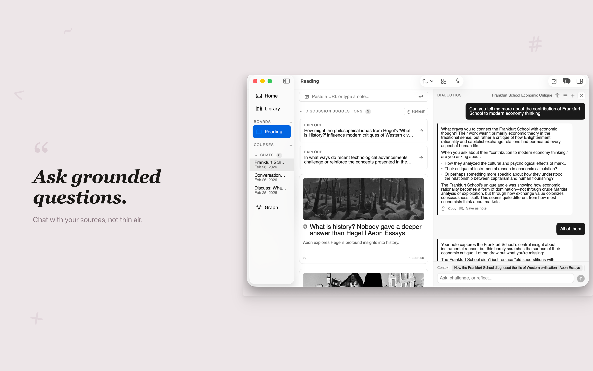

I put Claude Code in a dumb bash loop, pointed it at a spec, and walked away. It built most of a macOS app while I made dinner. This isn't a flex — the technique is so dumb it's named after Ralph Wiggum.

Grove is a knowledge workspace for macOS and iOS — notes, boards, AI-powered Socratic sessions, and a share extension for fast capture. That means SwiftData sync, native navigation primitives, a non-trivial model layer, and enough platform surface area to make an LLM work hard.

<p class="app-icon-wrap">
  
</p>





<p class="gallery-caption">Grove — a knowledge workspace for macOS and iOS. Capture, organize, and query your notes.</p>

The "ralph loop" is [Geoffrey Huntley's idea](https://ghuntley.com/ralph/), and the pitch is almost too simple to take seriously: a coding agent is just a few hundred lines of code running in a loop with LLM tokens. Each iteration gets fresh context. Memory lives on disk — git history, a progress file, a JSON spec tracking what's done. The agent reads the state, picks a task, does the work, runs the build. If the build passes, it commits. If not, the loop restarts and a new instance picks up the mess.

I tried this on a native Swift app — macOS first, then iOS/iPad — and came away with opinions. Some of them useful.

## The Mechanism

In my repo, the real loop is a bounded `for` pass in `ralph.sh`:

```bash
MAX_ITERATIONS=10

for i in $(seq 1 $MAX_ITERATIONS); do
  claude --dangerously-skip-permissions --print < CLAUDE.md
done
```

Each iteration reads `CLAUDE.md` plus a plan artifact, attempts one unit of work, and exits. If the agent prints `<promise>COMPLETE</promise>`, the outer loop breaks early. Otherwise it sleeps briefly and fires up a fresh instance. Ten iterations usually took around thirty minutes total.

What keeps this from going off the rails is **backpressure** — build failures, test failures, anything that produces a nonzero exit code. You're not asking the model whether the code is good. You're asking the compiler.

## Two Flavors

I fell into two distinct loop contracts over the course of the project. Which one worked better depended on what kind of work I was throwing at it.

### Flavor 1: Huntley-Orchestrator

This is the style closest to Huntley's original writeup. Hand the agent an evolving plan, let it pick the most important next task each cycle, trust the loop to find its own order.

In the iOS expansion phase, the plan artifact was `fix_plan.md`:

```markdown
# Fix Plan — Grove iOS/iPad
## P0: Foundation — Tuist, Entitlements, Shared Data
- [x] P0.1: Add `grove-ios` target to Project.swift
- [x] P0.5: Create SharedModelContainer for App Group data sharing
- [x] P0.7: Add platform guards to macOS-only files

## P1: Navigation Shell
- [x] P1.1: Add TabRootView (5-tab iPhone shell)
- [x] P1.3: Add iPad 3-column root layout
```

The iteration contract embedded in `CLAUDE.md` for this mode:

```markdown
## Iteration contract
1. Load context: read all specs/*.md and stdlib/*.md files (if present).
2. Read fix_plan.md.
3. Pick the first unchecked item that is implementation-ready.
4. Search the codebase before writing any code. Don't assume a feature
   isn't implemented — it may exist in an extension, protocol, or file
   you haven't seen yet.
5. Implement exactly that item.
6. Run required checks.
7. If checks pass, mark the item complete and commit.
8. If you discovered a new project-specific fact (build command,
   simulator UDID, gotcha), update AGENT.md via a subagent before exiting.
9. Exit after one item.
```

This mode handled the iOS port better than I expected. The P-series pass landed 28 commits in about three hours — faster than I would have scoped and sequenced the tickets myself. Cross-cutting work like targets, platform guards, navigation, and entitlements all have tangled dependencies, and letting the loop discover the right order turned out to be more efficient than me trying to impose one.

The tradeoff is you lose fine-grained control. If the agent decides story US-007 comes before the data layer it depends on, you're watching it fail three times before you intervene. But for breadth work — standing up a new platform, wiring a navigation shell — orchestrator mode earned its keep.

### Flavor 2: Ticketed Sequential

The tighter version. Scope one task, pin the context and checks, limit the blast radius. I wrote this iteration contract directly into `CLAUDE.md`:

```markdown
## Iteration contract
1. Read `prd.json` and pick the highest-priority story where `passes: false`.
2. Implement only that story (do not bundle extra work).
3. Run quality checks:
   - `tuist test` (required)
   - `tuist build` when the story changes view/layout-heavy code
4. If checks pass:
   - set that story's `passes` to `true`
   - update that story's `notes` with concise implementation details
   - append key learnings to `progress.txt`
   - commit with: `ralph: US-XXX - short title`
```

Writing this down explicitly mattered more than any clever prompting. It forced the agent to use the right command-line gate every single loop.

Ticket mode was most useful when acceptance criteria had to be verified in isolation, when macOS runtime behavior needed human checkpoints, or when I was debugging seam issues and didn't want collateral damage. More babysitting, tighter blast radius, higher reliability on narrow tasks.

My default dial by the end: **orchestrator for breadth, ticket mode for risk.**

The two contracts differ in a few key ways:

| | Ticketed Sequential | Huntley-Orchestrator |
|---|---|---|
| Plan artifact | `prd.json` | `fix_plan.md` |
| Task format | `passes: false` stories | unchecked markdown items |
| Context loading | none | reads `specs/*.md` + `stdlib/*.md` |
| Codebase search | not required | required before writing code |
| Learning storage | `progress.txt` | `AGENT.md` (via subagent) |
| Completion signal | implicit | `<promise>COMPLETE</promise>` |

## Why macOS Makes This Harder

Most ralph loop writeups are about web apps. Run Jest, check the exit code, done. Native Apple dev is a different animal.

### Builds Are Slow

Swift's type checker catches a lot of junk — exactly what you want for backpressure. But each iteration runs generation + build + test, and that adds up. Here's the actual commit cadence across four runs:

- **v3 simplification:** 14 commits in ~43min (Feb 18)
- **US-XXX UX alignment:** 13 commits in ~57min (Feb 19)
- **P-series iOS port:** 28 commits in ~3h (Feb 26)

Cost is the question I get asked most. The P-series run — 28 commits, three hours — cost around $12–18 in API calls using Sonnet-class models. Shorter runs (under an hour) came in under $5. The multiplier is how many iterations fail before a commit lands: a clean run is cheap, a run where the agent spins on a build error for five iterations is not.

The practical fix wasn't "avoid Apple build tooling." It was making it deterministic: Tuist as source of truth, `Project.swift` for configuration, strict `tuist generate → tuist test → tuist build` gates. I had to encode that exact flow into `CLAUDE.md` because otherwise the agent would pick inconsistent build paths and burn iterations on avoidable failures.

### AppKit Is an LLM Blind Spot

SwiftUI has tons of training data. AppKit's weird corners — `NSStatusItem`, `NSPopover` edge cases, `NSWindow` level management — do not. The agent kept reaching for SwiftUI where AppKit was the only viable tool.

One of Huntley's better insights: your codebase steers the agent more than your prompt does. I dropped patterned utility files into the project and the agent followed them. Here's one — `SelectableMarkdownView` wrapping `NSTextView` in `NSScrollView`:

```swift
let scrollView = NSScrollView()
scrollView.setContentHuggingPriority(.defaultLow, for: .horizontal)
scrollView.setContentCompressionResistancePriority(.defaultLow, for: .horizontal)

let textView = NSTextView()
textView.minSize = .zero
textView.maxSize = NSSize(
    width: CGFloat.greatestFiniteMagnitude,
    height: CGFloat.greatestFiniteMagnitude
)
textView.isVerticallyResizable = true
textView.isHorizontallyResizable = false
textView.autoresizingMask = [.width]
textView.textContainer?.widthTracksTextView = true
```

Once this existed in-repo, later agent output drifted less than when I repeated the same prompt warning for the fifth time.

Same idea applied to platform landmines. I kept a `## Gotchas` section in `CLAUDE.md`, but I didn't write most of it — the loop sessions did. The agent hits a problem, I feed the lesson back into the prompt, the next iteration doesn't repeat it. This is actually the most interesting property of the loop: it improves its own instructions over time. You're not just building software; you're building a progressively better spec for building software. By the end of the project, the gotchas section was a fairly accurate map of the platform landmines I hadn't anticipated when I started:

```markdown
## Gotchas
- `UIDevice.current` is @MainActor in Swift 6. Use @MainActor
  + Platform.isIPad helper.
- GroveShareExtension compiles all of grove/Sources/.
  `@main` guarded with `#if !SHARE_EXTENSION`.
  `UIApplication.shared` unavailable — use `@Environment(\.openURL)`.
- Tuist does not support mixing `sources` (glob) and
  `buildableFolders` for overlapping paths. Use `buildableFolders`
  consistently + compilation conditions for exclusions.
```

### Swift Concurrency Is a Trap

The agent's instinct when it hits an actor isolation error is to slap `@MainActor` on everything until the compiler shuts up. The code builds. It's also wrong — you get over-isolated types and unnecessary main-thread work.

The guardrail that actually helped was concrete: `UIDevice.current` is `@MainActor` in Swift 6, so isolate the small surface that needs it (a `Platform.isIPad` helper) instead of promoting entire view models to main-actor out of panic.

## Where I Had to Step In

**Anything visual.** The loop makes things functional, not pretty. Spacing, alignment, animation timing — all done by hand.

**Multi-system bugs.** When three subsystems interact and the bug is in the seam, the agent patches the nearest code and moves on. The root cause stays.

**Project graph management.** Hand-editing `.pbxproj` is agent-hostile. Tuist helped: `Project.swift` as source of truth, `tuist generate`, no asking the model to surgically mutate Xcode internals.

**Taste.** "The popover should feel snappy" isn't something a build gate can verify. Qualitative calls needed human eyes every time.

## What I'd Do Next Time

Write a better `CLAUDE.md` before writing any code. Even twenty minutes upfront on platform rules and build commands will save you from watching the loop fail in obvious ways.

Use Huntley mode earlier for expansion. Switch to ticket mode when the defect rate climbs or tasks get boundary-heavy.

Add runtime smoke tests. Even "launch the app and check it didn't crash" would have caught runtime failures the compiler missed.

Seed more pattern files. Good examples in the codebase produce better code than good instructions in the prompt.

Lock command discipline on day one. Define `tuist generate → tuist test → tuist build` in the prompt immediately instead of after burning a few loops discovering you need it.

## Try It

The barrier is low. You need a bash loop and a prompt file.

Start with [snarktank/ralph](https://github.com/snarktank/ralph) for a ready-made setup, or write the 20-line loop yourself. Write a tight PRD where each story fits in one context window. Invest in backpressure. Seed your project with good patterns. Watch the first few loops before you walk away — you'll learn more about your own spec from watching the agent misinterpret it than from any amount of review.

The ralph loop isn't magic and it won't replace you. What it does is make the feedback cycle between "write a spec" and "see if the spec was any good" very fast. That's the bottleneck most of the time anyway.

Next on my list: running this pattern against the Grove share extension — a target that compiles the entire app but runs in a sandboxed context with different API constraints. If the loop can navigate that without me babysitting every commit, I'll consider it properly stress-tested.

---

*Tobias Fu builds iOS and macOS apps in Swift. Sometimes he lets a bash script do it instead. [github.com/realtobyfu](https://github.com/realtobyfu)*
